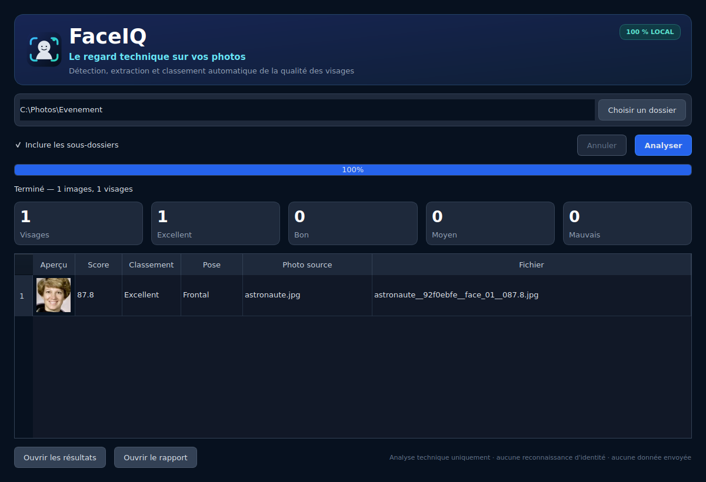

  

<h1 align="center">FaceIQ</h1>

<strong>Le regard technique sur vos photos.</strong>

FaceIQ est une application Windows locale qui détecte les visages présents
dans un dossier de photos, les extrait, évalue leur qualité technique et classe
les résultats. Aucune photo n'est envoyée vers un service en ligne.

## Fonctionnalités

- interface graphique Windows 10/11 ;
- analyse d'un dossier et, au choix, de ses sous-dossiers ;
- détection locale des visages frontaux et des profils gauche/droit ;
- extraction avec une marge autour du visage ;
- score technique sur 100 : netteté, luminosité, taille, cadrage, orientation
  et confiance de détection ;
- classement **Excellent**, **Bon**, **Moyen** ou **Mauvais** ;
- galerie intégrée, rapports CSV et HTML ;
- annulation, journal local et poursuite du lot lorsqu'une image est illisible ;
- véritable installateur Windows avec entrée de désinstallation.

La note ne mesure ni l'identité, ni l'attractivité, ni une caractéristique
personnelle.

## Installer FaceIQ

Télécharger **FaceIQ-Setup-1.0.0.exe** depuis la
[dernière Release](https://github.com/RCKcorp/FaceIQ/releases/latest), lancer
le setup puis ouvrir FaceIQ depuis le menu Démarrer.

L'installation est effectuée pour l'utilisateur courant et ne demande pas de
droit administrateur. FaceIQ apparaît ensuite dans **Applications installées**
et peut être désinstallé normalement.

## Utilisation

1. Cliquer sur **Choisir un dossier**.
2. Activer ou non l'analyse des sous-dossiers.
3. Cliquer sur **Analyser**.
4. Consulter la galerie puis ouvrir le dossier de résultats ou le rapport.

Les résultats sont créés à côté du dossier analysé :

~~~text
FaceIQ_Resultats_YYYYMMDD_HHMMSS/
├── Excellent/
├── Bon/
├── Moyen/
├── Mauvais/
├── Tous_les_visages/
├── rapport_analyse.csv
└── rapport_analyse.html
~~~

## Validation

La suite comprend 13 tests, dont une validation locale sur un corpus public de
100 vrais visages variés, 100 images sans visage et une photographie de
profil. Lors de la validation V1 : 88 visages sur 100 ont été détectés et
5 images sans visage sur 100 ont produit au moins une détection.

Les détails et les limites sont documentés dans
[docs/VALIDATION.md](docs/VALIDATION.md).

## Développement

Prérequis : Python 3.11 x64.

~~~powershell
py -3.11 -m venv .venv
.\.venv\Scripts\Activate.ps1
python -m pip install -r requirements-dev.txt
$env:PYTHONPATH="src"
python -m faceiq
~~~

Pour exécuter les tests :

~~~powershell
python -m pytest
~~~

Pour construire l'EXE puis, si Inno Setup 6 est installé, le setup :

~~~powershell
.\build.ps1
~~~

GitHub Actions vérifie les tests, construit **FaceIQ.exe**, compile le setup et
publie la Release **v1.0.0** lors de la mise à jour de **main**.

## Confidentialité

- traitement entièrement local ;
- aucun compte requis ;
- aucune télémétrie ;
- aucune reconnaissance d'identité ;
- aucune photo de test ajoutée au dépôt.

## Licence

Code distribué sous [licence MIT](LICENSE). Les bibliothèques tierces conservent
leurs licences respectives, récapitulées dans
[THIRD_PARTY_NOTICES.md](THIRD_PARTY_NOTICES.md).
